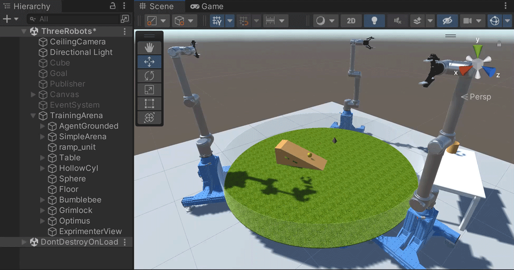

# FetchGamePhysicsTraining

<p align="center">

</p>

## Summary

This package (`org.johnson-lab-janelia.fetch-game-physics-training`) prepares the companion [`FetchGamePhysics` project](https://github.com/JohnsonLabJanelia/FetchGamePhysics) for deep reinforcement learning using [Unity ML-Agents](https://github.com/Unity-Technologies/ml-agents) version 2.  The code in this package builds on the [`org.janelia.easy-ml-agents` package](https://github.com/JaneliaSciComp/janelia-unity-toolkit/tree/master/org.janelia.easy-ml-agents).

## Usage

1. Clone [this repo](https://github.com/JohnsonLabJanelia/FetchGamePhysicsTraining).

1. Clone the [`janelia-unity-toolkit` repo](https://github.com/JaneliaSciComp/janelia-unity-toolkit) to get access to the [`org.janelia.easy-ml-agents` package](https://github.com/JaneliaSciComp/janelia-unity-toolkit/tree/master/org.janelia.easy-ml-agents).

1. Install the [Git Large File Storage (LFS) extension](https://git-lfs.github.com/), which is needed for cloning the next repo.

1. Clone the [`FetchGamePhysics` repo](https://github.com/JohnsonLabJanelia/FetchGamePhysics) to get access to [`FetchArenaProject`](https://github.com/JohnsonLabJanelia/FetchGamePhysics/tree/main/FetchArenaProject), the actual Unity project.

1. In [Unity Hub](https://unity3d.com/get-unity/download), click the "Open" button, navigate into the downloaded `FetchGamePhysics` repo and choose the `FetchArenaProject` directory (folder).  The Unity editor should launch and load the project.  There may be an option to use a newer version of the editor, and doing so should work.  With a newer editor there may be prompts to upgrade assets, and doing so should work.

1. In the Unity editor's "Project" tab, navigate to "Assets/Scenes", and double-click on `ThreeRobots.unity`.  The three robot arms should appear, along with the green turf, the brown ramp, and the white table.

1. In the Unity editor's "Window" menu, choose "Package Manager".

1. In the Package Manager window, click the "+" button in the upper left corner, and choose "Add package from disk..."

1. Navigate to the downloaded `janelia-unity-toolkit` repo, and into the `org.janelia.easy-ml-agents` directory (folder), and choose the `package.json` file. The package should load, along with its dependency, [`com.unity.ml-agents`](https://github.com/Unity-Technologies/ml-agents).

1. In the Package Manager window, click the "+" button and "Add package from disk..." again.

1. Navigate to the downloaded `FetchGamePhysicsTraining` repo and choose the `package.json` file.  The package should load.

1. The agent's observations and rewards are implemented in the `Runtime/FetchGamePhysicsTrainingAgent.cs` file in the `FetchGamePhysicsTraining` repo.  The current approach works, to an extent, but is quite primitive.  To try new approaches, change the observations made in the `CollectObservations` method, and the rewards assigned in the `OnActionReceived` and `OnCollisionEnter` methods.

1. In the Unity editor's "GameObject" menu, choose the "Create Easy ML Arena and Agent" item.  Most of the objects in the Unity scene should now be under a new `TrainingArena` object.

1. In the Unity editor's Hierarchy view, right click on the `TrainingArena` object and choose "Duplicate" from the context menu.  Error messages may appear ("Only the root body of the articulation can be made immovable") but they are related to the robot arms and their control with [ROS](https://github.com/Unity-Technologies/Unity-Robotics-Hub/blob/main/tutorials/ros_unity_integration/README.md), and do not seem to affect training with ML-Agents.

1. Select the new `TrainingArena (1)` object, and in the Unity Inspector, set the _x_ coordinate of its position to 8.  It should translate so it no longer overlaps the orginal arena.

1. Follow the previous few steps to make additional copies of the arena as desired, to allow training to proceed in parallel.  The appropriate number depends on the capabilities of the computer running the training, but a total four to eight arena instances may be appropriate.

1. Install the ML-Agents Python scripts that manage the details of training outside of Unity.  The process is straightforward and well documented in the [ML-Agents installation instructions](https://github.com/Unity-Technologies/ml-agents/blob/main/docs/Installation.md).  These instructions involve creating a
[Python Virtual Environment](https://github.com/Unity-Technologies/ml-agents/blob/release_19_docs/docs/Using-Virtual-Environment.md); at least on Windows, the alternative of using [Conda](https://docs.conda.io/en/latest/) for package management [seems to be deprecated](https://github.com/Unity-Technologies/ml-agents/blob/main/docs/Installation-Anaconda-Windows.md).  Note that on Windows, [PyTorch must be installed first in a separate step](https://github.com/Unity-Technologies/ml-agents/blob/main/docs/Installation.md#windows-installing-pytorch).

1. In a shell, run the Python scripts with a command like:
    ```
    mlagents-learn trainer_config.yaml --run-id FetchGamePhysicsTraining_01
    ```
    The `trainer_config.yaml` file from the root directory (folder) of [this repo](https://github.com/JohnsonLabJanelia/FetchGamePhysicsTraining) is an reasonable starting point.

1. Press play in the Unity editor to start the training.

1. To monitor results, run a command like the following in the directory (folder) where `mlagents-learn` was run:
    ```
    tensorboard --logdir results --port 6006
    ```
    Then open http://localhost:6006 in a web browser.

1. If training indicates that the code needs to be refined, the next round of training can proceed immediately after changes to the `CollectObservations`, `OnActionReceived`, and `OnCollisionEnter` methods.  Changes to other code could require choosing the "GameObject/Create Easy ML Arena and Agent" menu item again.  See the [documentation for `org.janelia.easy-ml-agents`](https://github.com/JaneliaSciComp/janelia-unity-toolkit/tree/master/org.janelia.easy-ml-agents#5-refine) for more details.

1. If any aspect of this system does not work as it should, please [add an issue for this repo](https://github.com/JohnsonLabJanelia/FetchGamePhysicsTraining/issues).

## Training Performance

As discussed in the [`org.janelia.easy-ml-agents` documentation](https://github.com/JaneliaSciComp/janelia-unity-toolkit/tree/master/org.janelia.easy-ml-agents#training-performance), training is fastest when run with a stand-alone executable, not with the editor (as described above).  With this approach, it should be possible for the executable to contain at least 27 instances of the arena, arranged in a 3 x 3 x 3 cube.  With this arranement, training to a full 5 million steps completes in a couple of hours, even on a laptop.